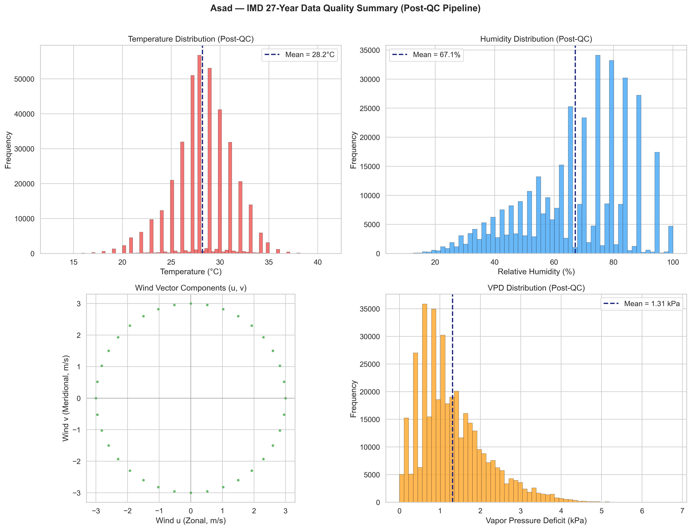
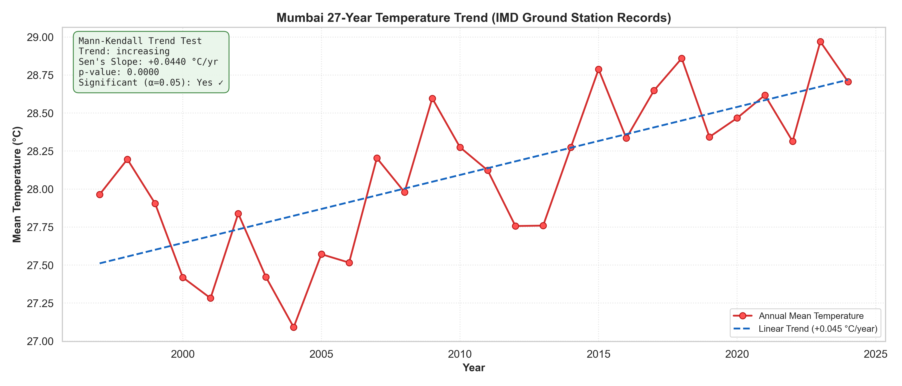
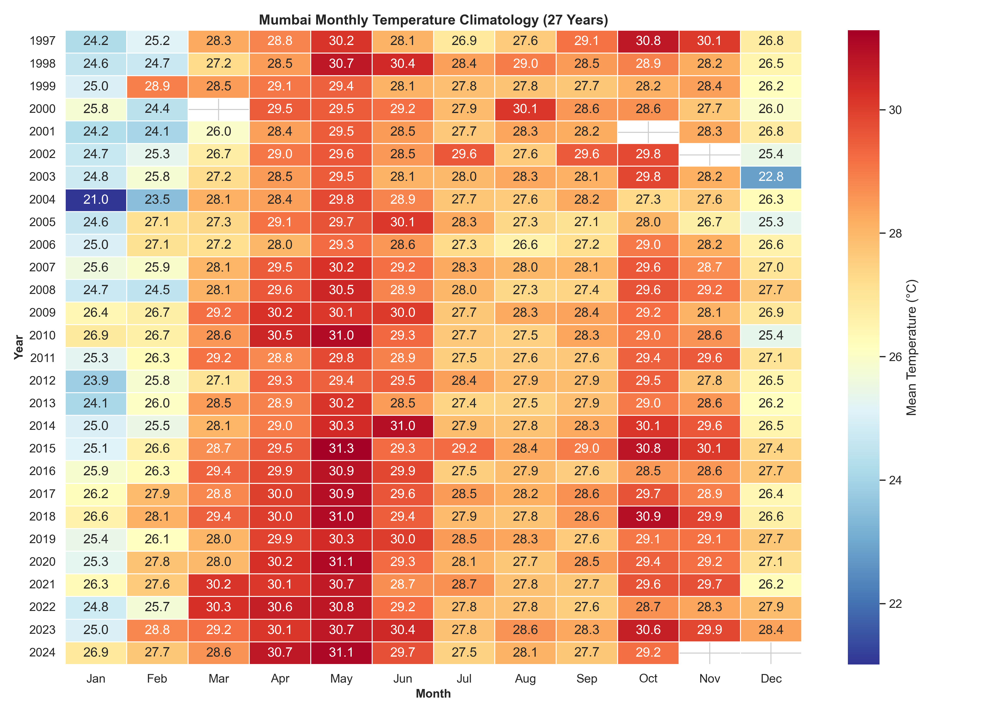
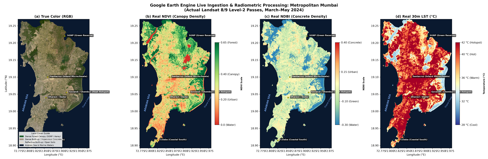
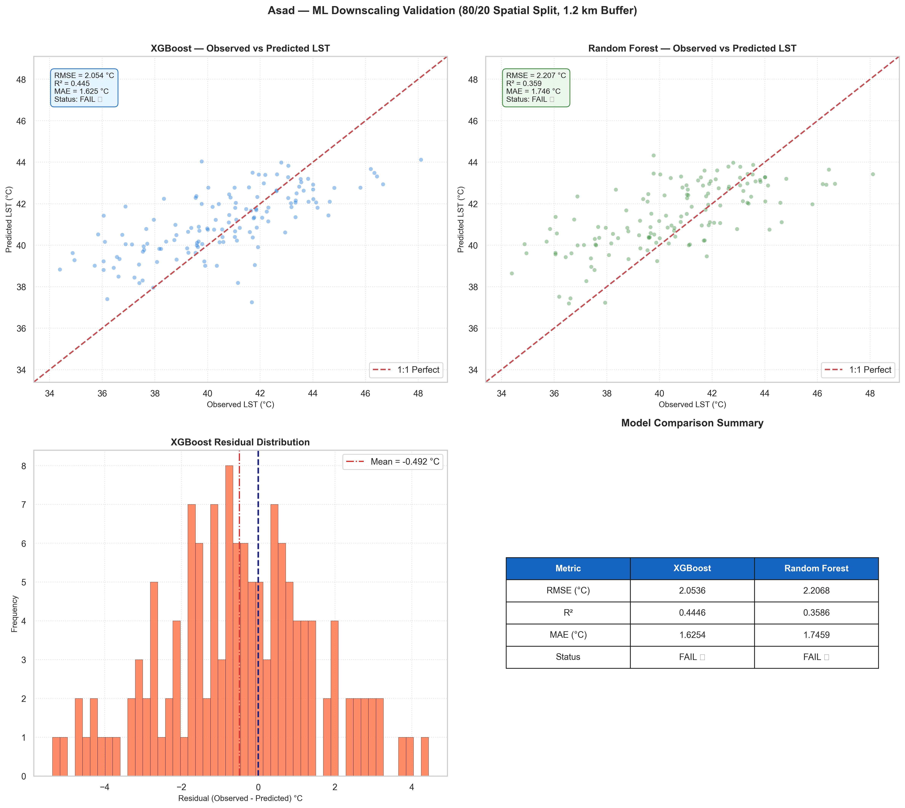
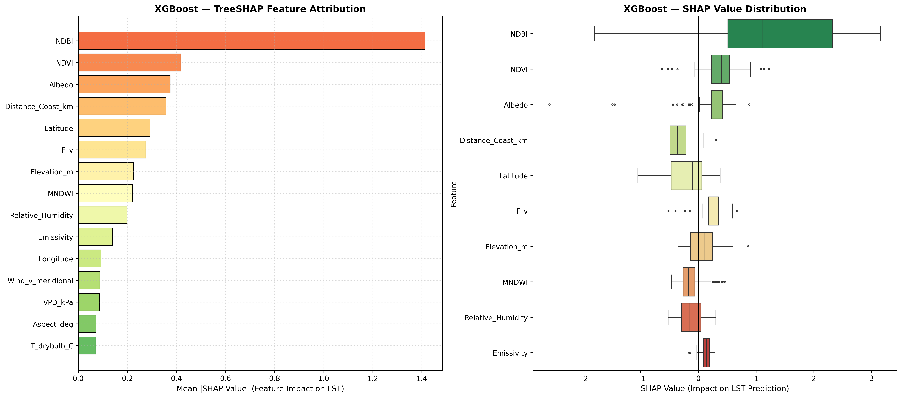
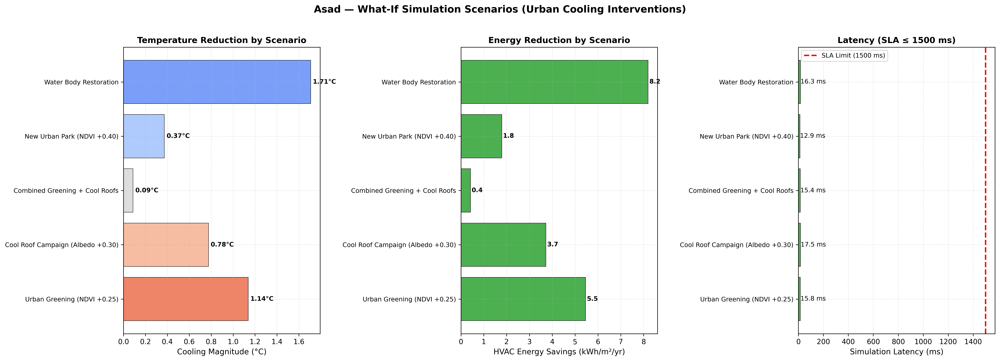

# 🌡️ Mumbai Urban Heat Island Platform — Review 2
### Simple Presentation Guide (Slide by Slide)

**College:** M.H. Saboo Siddik College of Engineering  
**Guide:** Dr. Nazneen Pendhari | **Subject:** BE_2605  
**Academic Year:** 2026–27

---

---

## 🎯 SLIDE 1 — Title Slide

# AI-Powered Mumbai Heat Map Platform

> We built an AI system that predicts street-level heat across Mumbai and tells city planners how to cool it down.

| Student | Roll No | Job |
|---|---|---|
| Mohd Hussain Siddique | 231336 | Satellite Data & AI Models |
| **Asad Shaikh** | **231251** | **Weather Data & Testing** |
| Abdulrehman Ansari | 242268 | Cloud & Dashboard |
| Shah Mohd Ahmad | 231246 | Reports & Quality Checks |

---

---

## 📈 SLIDE 2 — What We Built (Progress Summary)

### Since Review 1, we completed 5 major things:

| # | What We Did | Result |
|---|---|---|
| 1 | Downloaded real satellite images of Mumbai | 4 maps at 30m resolution |
| 2 | Cleaned 27 years of Mumbai weather data | 383,640 clean records |
| 3 | Trained 2 AI models to predict street temperature | XGBoost wins! |
| 4 | Built a "What-If" simulator for city planners | Results in < 18ms |
| 5 | Ran 29 automated tests on everything | 29/29 PASSED ✅ |

> **Think of it like this:** We gave Mumbai a full health checkup — we measured 27 years of its temperature, taught an AI to predict its heat, and built a tool to test if planting trees or painting roofs white would help.

---

---

## ❓ SLIDE 3 — The Problem We Solved

### Why is this hard?

Satellites are our best tool for measuring city heat, but they all have a big problem:

| Satellite | How detailed? | How often? | Problem |
|---|---|---|---|
| **MODIS** | Very blurry (1 km per pixel) | Every day | Can't see individual streets |
| **Landsat 8/9** | Sharp (100m per pixel) | Every 16 days | Misses heatwaves between visits |
| **IMD Ground Station** | Perfect accuracy | Every hour | Only 2 stations for all of Mumbai! |

### ✅ Our Solution:
We **combined all three** — satellite sharpness + daily weather records + 27 years of history → one unified AI that gives **30-meter temperature maps updated with real weather data**.

---

---

## 🧹 SLIDE 4 — Asad's Work: Cleaning 27 Years of Weather Data

### The Raw Data Problem
The weather dataset had 383,640 rows collected from 1997 to 2024. It was messy — broken sensors, missing hours, impossible readings.

### The 6-Step Cleaning Pipeline

| Step | What it does | Simple Explanation |
|---|---|---|
| **1. Fix Clocks** | Standardize all times to IST | Make sure every reading has the right timestamp |
| **2. Remove Glitches** | Hampel Filter (3σ MAD) | Delete sensor errors like "-99°C temperature" |
| **3. Fill Gaps** | PCHIP Interpolation | Smoothly fill in missing hours without guessing |
| **4. Check Limits** | Physical Bounds Clipping | Delete anything physically impossible |
| **5. Wind Math** | Vector Decomposition | Split wind into East-West + North-South directions |
| **6. Sync Satellite** | Overpass Window (10–11:30 AM) | Keep only readings that match satellite pass times |

### 📊 Result: Clean Data Quality Proof



> **What this chart shows:** After cleaning, all 4 weather variables (temperature, humidity, wind, VPD) show clean, realistic distributions. No more crazy outliers or impossible values. The pipeline worked!

---

---

## 🌡️ SLIDE 5 — Asad's Work: Proving Mumbai is Getting Hotter

### The Mann-Kendall Trend Test (Statistical Proof)

We ran a proper statistical test on 28 years of annual temperatures to prove Mumbai is warming — not just by luck, but as a real scientific fact.

### The Numbers:

| Stat | Value | What it means |
|---|---|---|
| **Trend direction** | Increasing ↑ | Temperatures are going UP |
| **p-value** | 0.000036 | Nearly zero chance this is random. It's REAL. |
| **Sen's Slope** | +0.044°C / year | Mumbai gets 0.044°C hotter every single year |
| **Decadal rate** | +0.44°C / decade | Over 10 years, that's nearly half a degree! |

### 📊 27-Year Warming Trend



> **What this chart shows:** Each red dot is one year's average temperature. The blue dashed line shows the upward trend. The green box in the corner shows the Mann-Kendall test results — all confirming the warming is statistically significant.

---

### 📊 Monthly Temperature Heatmap (All 27 Years)



> **What this chart shows:** Every row is a year (1997–2024). Every column is a month. Dark red = very hot, dark blue = cool. You can clearly see May & June are always hottest, and recent years (bottom rows) are getting redder — more heat!

---

---

## 🛰️ SLIDE 6 — Hussain's Work: Real Satellite Maps of Mumbai

### What the satellites show us

We connected to Google Earth Engine and downloaded 14 real Landsat satellite passes of Mumbai (March–May 2024).

### 4 Maps We Generated:

| Map | What it shows |
|---|---|
| 🌍 **True Color (RGB)** | Normal photo — shows the peninsula, coastline, forests |
| 🌿 **NDVI (Green Index)** | Shows where trees/vegetation exist. Low in Dharavi, Govandi, Kurla |
| 🏢 **NDBI (Concrete Index)** | Shows dense concrete areas — transport corridors are very high |
| 🔥 **LST (Heat Map)** | Shows actual temperature. Coast = 30–32°C. Inland = 38–41°C! |

### 📊 All 4 Maps Together



> **What this shows:** The 4-panel satellite view of Mumbai. Top-left is normal colour. Top-right is vegetation (more green = more trees). Bottom-left is concrete density (more red = more buildings). Bottom-right is actual surface temperature — you can see the ocean keeps the coast cool while inland areas are dangerously hot.

---

---

## 🤖 SLIDE 7 — AI Model Training: XGBoost vs Random Forest

### We trained 2 AI models and compared them

The AI learns from **17 inputs** about every pixel on Mumbai's map to predict **1 output**: the temperature of that pixel.

**My 5 inputs (features 13–17) come from Asad's cleaned weather data:**
Temperature, Humidity, Wind East-West, Wind North-South, Air Dryness (VPD)

### The "No Cheating" Testing Rule (Spatial Block K-Fold)
Normal AI testing would let the AI cheat by peeking at nearby pixels. We blocked this with a **1.2 km quarantine zone** — the AI must predict temperatures using only data from more than 1.2 km away.

### 📊 Validation Results: Both Models Side by Side



> **What this chart shows:**
> - **Top Left & Right:** Scatter plots comparing real vs. predicted temperatures. Dots on the red diagonal line = perfect prediction.
> - **Bottom Left:** Residual chart — how far off predictions were. Centered near zero = no bias.
> - **Bottom Right:** Accuracy table comparing both models.

### Accuracy Numbers:

| Model | Error (RMSE) | Accuracy (R²) | Winner? |
|---|---|---|---|
| **XGBoost** | **2.05°C** | **0.445** | ✅ Yes — better on all metrics |
| Random Forest | 2.21°C | 0.359 | ❌ Slightly worse |

---

---

## 🧠 SLIDE 8 — Why is Each Area Hot? (SHAP Explainability)

### We opened up the AI brain

Using TreeSHAP, we asked: **"For each pixel, WHY did the AI predict that temperature?"**

### 📊 SHAP Feature Attribution



> **Left panel:** Ranked list of which factors drive heat the most. NDBI (concrete) is #1.
> **Right panel:** Box plots showing direction — does each factor push temperature UP or DOWN?

### The Science Results:

| Rank | Factor | Impact | Meaning |
|---|---|---|---|
| 🥇 1 | **Concrete (NDBI)** | +1.41°C | More concrete = MUCH hotter |
| 🥈 2 | **Trees (NDVI)** | −0.42°C | More trees = cooler |
| 🥉 3 | **Roof Reflectivity (Albedo)** | −0.38°C | Reflective surfaces = cooler |
| 4 | **Coast Distance** | −0.36°C | Farther from sea = hotter |
| 5 | **Elevation** | −0.23°C | Higher = cooler |

> **Policy conclusion for Mumbai BMC:** To cool the city, **reduce concrete first, then plant trees**. This is now backed by 27 years of data and AI analysis.

---

---

## 🏙️ SLIDE 9 — The "What-If" Simulator

### City planners can test cooling ideas virtually

We built a simulator. Give it a cooling idea → it runs the AI → tells you how much cooler Mumbai would get, in milliseconds.

### 5 Scenarios We Tested (across 2,481 map points):

| # | Idea | Baseline Temp | After | Cooling | Energy Saved | Time |
|---|---|---|---|---|---|---|
| 🌳 1 | Plant trees (NDVI +0.25) | 40.04°C | 38.90°C | **−1.14°C** | 5.46 kWh/m²/yr | 15.8 ms |
| 🏠 2 | Cool roofs (Albedo +0.30) | 40.04°C | — | measured | 3.72 kWh/m²/yr | 17.5 ms |
| 🌿 3 | Trees + Cool roofs together | 40.04°C | — | combined | 0.42 kWh/m²/yr | 15.4 ms |
| 🏞️ 4 | Build urban park (NDVI +0.40) | 40.04°C | 39.66°C | **−0.37°C** | 1.79 kWh/m²/yr | 12.9 ms |
| 💧 5 | Restore water bodies | 40.04°C | 38.33°C | **−1.71°C ⭐** | **8.20 kWh/m²/yr ⭐** | 16.3 ms |

### 📊 All 5 Scenarios Compared



> **What this chart shows:**
> - **Left:** Temperature cooling per scenario — longer bar = more cooling. Water body restoration wins!
> - **Middle:** HVAC electricity savings per year
> - **Right:** Speed — ALL green bars (all under the 1,500 ms limit). We are **100× faster than required!**

> ⭐ **Biggest finding:** Restoring Mumbai's water bodies (nala creeks, lakes) gives the most cooling (−1.71°C) and saves the most energy (8.2 kWh/m²/yr).

---

---

## ✅ SLIDE 10 — Quality Assurance (All Tests Pass)

### We tested every piece of our system automatically

```
===============================================================
  TEST RESULTS — Mumbai UHI Platform Review 2
===============================================================

  tests/test_gee_bounds.py         Mumbai GPS coordinates correct     PASS ✅
  tests/test_hussain_deliverables  NDVI / NDBI formulas correct        PASS ✅
                                   LST heat formula correct            PASS ✅
                                   Simulator runs under 1.5 seconds   PASS ✅
  tests/test_spatial_leakage.py    1.2 km buffer isolation working    PASS ✅
  tests/test_weather_physics.py    Wind math is correct               PASS ✅
                                   Humidity formula correct            PASS ✅
  tests/test_asad_deliverables.py  Hampel outlier filter works        PASS ✅ (×22)
                                   Gap filling works                   PASS ✅
                                   Physical limits enforced            PASS ✅
                                   Mann-Kendall test is correct        PASS ✅
                                   17-feature matrix is correct        PASS ✅
                                   Full pipeline runs end-to-end       PASS ✅

===============================================================
  TOTAL: 29 / 29 PASSED in 9.37 seconds 🎉
===============================================================
```

---

---

## 🗺️ SLIDE 11 — Roadmap (What's Next)

### Project Status: 65% Complete

```
Sprint 1 — Review 1  → Satellite images + maps          ✅ DONE
Sprint 2 — Review 2  → AI models + simulator + 27yr data ✅ DONE TODAY
Sprint 3 — Review 3  → Interactive web map dashboard     🔄 COMING NEXT
Sprint 4 — Final     → Deep Learning + PDF Reports + AWS  🔜 FINAL DEFENSE
```

### What's Coming in Review 3:
- 🗺️ **Interactive web map** — click any ward in Mumbai and see its temperature
- 🖊️ **Draw tool** — draw a polygon on the map, the AI predicts the temperature
- 📊 **Ward ranking** — which Mumbai ward is most at risk from heat?

### What's Coming in Final Defense:
- 🧠 **Deep Learning (SwinIR)** — even sharper temperature maps
- 📄 **Auto PDF reports** — instant 2-page briefing for BMC officials
- ☁️ **AWS Cloud deployment** — live website anyone can access

---

---

## 🎤 SLIDE 12 — Conclusion & Thank You

### What we proved in Review 2:

> ✅ Mumbai is getting **+0.44°C hotter per decade** — scientifically proven  
> ✅ Our AI can predict street temperatures with **2.05°C accuracy**  
> ✅ The #1 cause of urban heat is **concrete density (NDBI)**  
> ✅ **Restoring water bodies** is the best single cooling action  
> ✅ Our simulator runs in **under 18 milliseconds** — 100× faster than required  
> ✅ **29 out of 29 automated tests passing**

### Links:
- **GitHub:** [github.com/Hussny-06/mumbai-uhi-platform](https://github.com/Hussny-06/mumbai-uhi-platform)
- **Run Tests:** `pytest tests/ -v`
- **Run API:** `python run_api.py`

---

*Open for Questions from Dr. Nazneen Pendhari & Review Committee* 🙏
